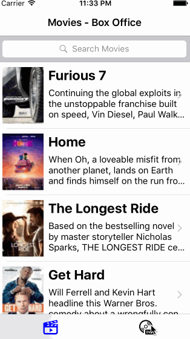

# RottenTomatoes
Codepath Week 1 Assignment

Time spent: ~10 hours (rough estimate)

Completed stories:
* User can view a list of movies from Rotten Tomatoes. Poster images must be loading asynchronously.
* User can view movie details by tapping on a cell.
* User sees loading state while waiting for movies API.
* User sees error message when there's a networking error.
* User can pull to refresh the movie list.
* Add a tab bar for Box Office and DVD. (optional)
* Add a search bar. (optional)
* All images fade in (optional)
* For the large poster, load the low-res image first, switch to high-res when complete (optional)

